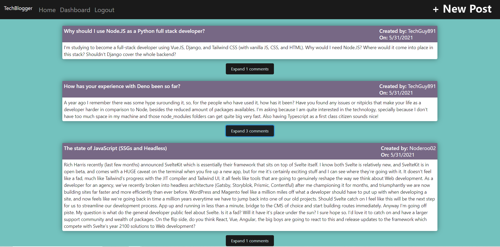
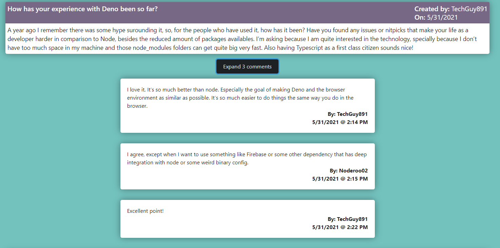

  

# TechBlogger

## Description 
TechBlogger is an MVC based technology-centered community posting app designed to make the sharing of ideas in the coding world simple, intuitive and fun!

## Table of Contents
1. [Installation](#installation)
2. [How to use website features](#how-to-use-website-features)
3. [Code contribution](#code-contribution)
4. [Tests](#tests)
5. [Application link](#application-deployed-link)
6. [Screenshot](#application-screenshot)

## Installation
- Install Node.js  
- Install package.json using command - ’npm init’
- Install express
- Instal mysql
- Install dotenv
- Install express-handlebars
- Install express-session
- Install connect-session-sequelize
- Install bcrypt

## How to use website features
- Navigate to the server.js directory.
- Run the script via command - npm start
- Navigate to the http://localhost:3001/

## Run the script via command - node server.js
https://nodejs.org/en/.
https://www.npmjs.com/
https://stackoverflow.com/
https://shields.io/.
https://expressjs.com/
https://www.mysql.com/
https://www.npmjs.com/package/mysql
https://www.npmjs.com/package/dotenv
https://www.npmjs.com/package/method-override 
https://sequelize.org/ 
https://handlebarsjs.com/ 

## Application deployed link

## Application screenshot

